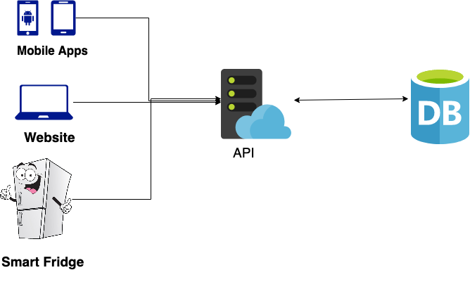

Slight RESTful - Introduction to API Design
========================================================
author: Jan Dix and Jakob Speier
date: 
autosize: true
css: presi.css

Who are We?
========================================================

## Jan

Likes JavaScript

Developer @ cause&effect

***
## Jakob

Likes python, pasta and peperonis.

Uni Konstanz

Why API? Why REST?
========================================================
## What APIs look like

***
* One stop shop for all applications
* Freedom for programmers to add and alter endpoints
* No need to expose DB to the Internet


Why API? Why REST?
========================================================
## RESTful


HTTP Basics (1/N)
========================================================
## Status Codes
* 200: All is good
* 201: Created
* 400: Bad Request 
* 403: You are not priviledged
* 404: Resource Missing
* 500: Server is having troubles

HTTP Basics (2/N) 
========================================================
## Methods
Most often - think CRUD
* **C**reate    -   POST
* **R**ead      -   GET
* **U**pdate    -   PUT
* **D**elete    -   DELETE

These cover most use cases for Databases!

HTTP Basics (3/N)
========================================================
incremental: true
## URI

<span class="red">http://</span>www.example.com/pasta/dry?type=farfalle

* http:// : Protocol
* www\.example : Host
* .com : TLD - Top Level Domain
* /dry : Parameter
* ?type : Query
* =farfalle : Query Value

Hands on!
========================================================

```python
import requests

r = requests.get("http://www.example.com/past/wet?tortelli")
r.status_code
```

